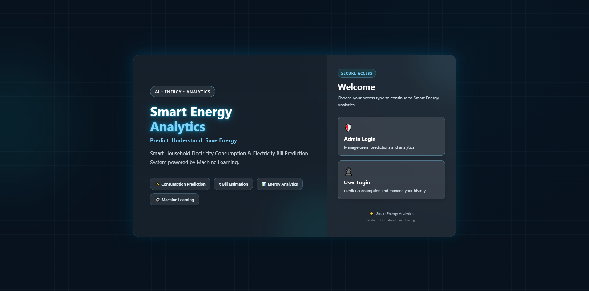
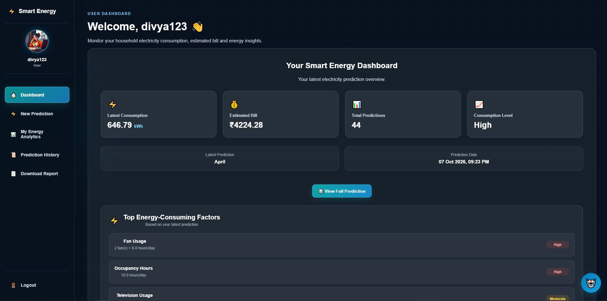
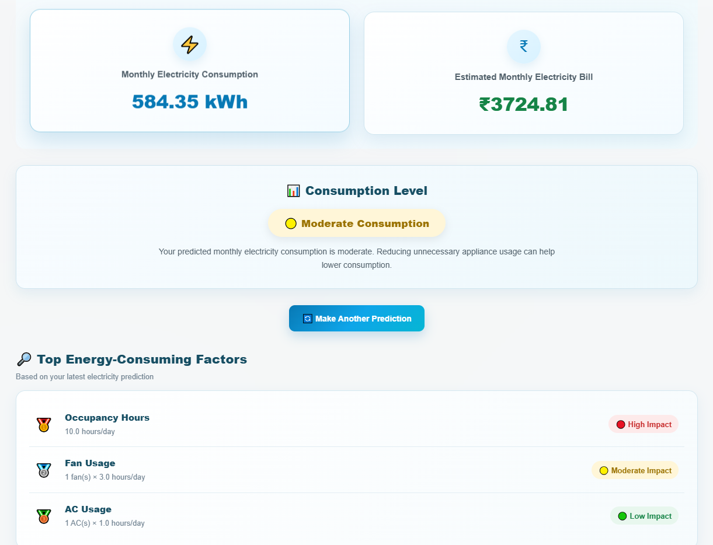
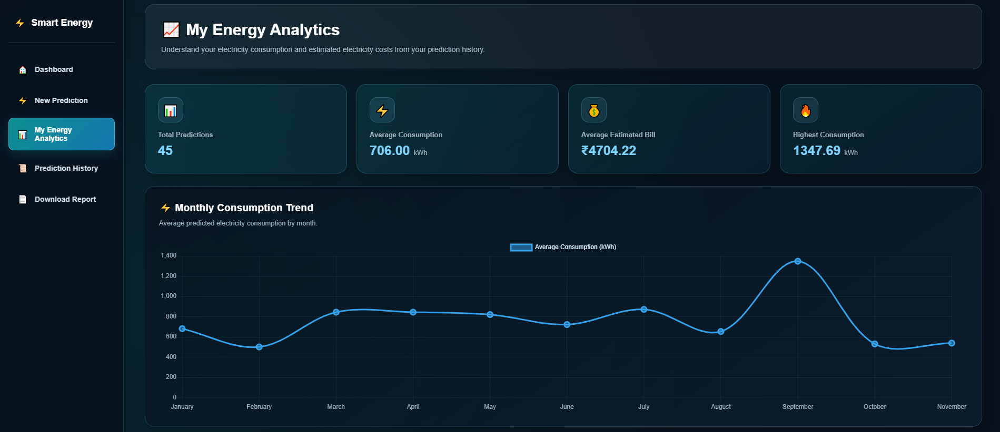
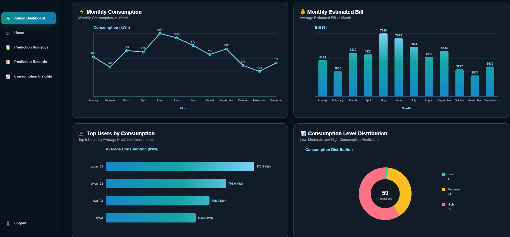

# Smart Household Electricity Consumption & Electricity Bill Prediction System

A Machine Learning and Django-based web application that predicts household monthly electricity consumption and estimates electricity bills using household usage, appliance, occupancy, temperature, seasonal, and historical consumption information.

## 🖥️ Application Preview

### Home Page



### User Dashboard



### Prediction Result



### User Analytics



### Admin Dashboard



---

## 📌 Project Overview

The Smart Household Electricity Consumption & Electricity Bill Prediction System helps households estimate their monthly electricity consumption and electricity bill.

The application combines a pre-trained Machine Learning model with a Django web application. Users enter household and electricity-usage information, and the system generates:

- Monthly electricity consumption prediction in kWh
- Estimated monthly electricity bill in ₹
- Consumption level
- Energy consumption factors
- Energy-saving recommendations
- Downloadable PDF prediction report

The application also provides an Admin Dashboard for monitoring registered users, prediction records, consumption statistics, and analytics.

---

## 🎯 Objectives

- Predict monthly household electricity consumption.
- Estimate the corresponding monthly electricity bill.
- Identify household energy-consumption factors.
- Provide energy-saving recommendations.
- Maintain prediction history for users.
- Provide analytics for administrators.
- Generate downloadable prediction reports.
- Build an end-to-end Machine Learning web application using Django.

---

## 🚀 Key Features

### 👤 User Features

- User registration and login
- Profile photo support
- User dashboard
- Household electricity prediction form
- Monthly electricity consumption prediction
- Estimated electricity bill calculation
- Consumption-level classification
- Energy consumption insights
- Energy-saving recommendations
- Prediction history
- Detailed prediction view
- Downloadable PDF report
- Personal energy analytics
- Smart Energy chatbot
- Password reset functionality
- Logout functionality

### 👨‍💼 Admin Features

- Separate admin login
- Admin dashboard
- Registered user management
- User details
- User prediction history
- Prediction details
- Total users statistics
- Total predictions statistics
- Average consumption analytics
- Average estimated bill analytics
- Highest consumption information
- Prediction activity chart
- Monthly consumption chart
- Monthly estimated bill chart
- Top users by consumption
- Consumption-level distribution
- PDF prediction report access

---

## 🤖 Machine Learning

The application uses a pre-trained Machine Learning regression model to predict monthly household electricity consumption.

The trained deployment package is reused by the Django application during prediction rather than retraining the model for every request.

### Model Used

**Gradient Boosting Regressor**

The model was trained and tuned for household electricity consumption prediction.

### Model Performance

The Gradient Boosting Regressor was evaluated during model selection and hyperparameter tuning.


| Metric | Reported Result |
|---|---:|
| Best Cross-Validation R² Score | 0.9601 |
| Tuned R² Score | 0.9609 |
| Mean Absolute Error (MAE) | 43.58 |
| Root Mean Squared Error (RMSE) | 61.74 |


Best Tuned Parameters
- Learning Rate: 0.1
- Maximum Depth: 3
- Number of Estimators: 150

Interpretation

- R²: The reported scores indicate that the model achieved a strong fit on the evaluated data.
- MAE: Measures the average absolute difference between actual and predicted values.
- RMSE: Measures prediction error while penalizing larger errors more heavily than MAE.

Evaluation note: The MAE and RMSE values are reported from the model-selection or tuning evaluation. They should not be interpreted as independent test-set results unless separately verified. Error metrics use the target variable's units; if the target was monthly electricity consumption measured in kWh, the units are kWh.

---

## 📊 Input Features

The prediction system uses household, appliance, usage, environmental, seasonal, and historical consumption information.

Major input and model features include:

- Month
- Number of People
- Number of Rooms
- AC Count
- Fan Count
- Refrigerator
- Washing Machine
- Television Count
- Geyser
- Water Pump
- Computer Count
- Temperature
- Occupancy Hours
- Weekend Usage
- Daily AC Hours
- Daily Fan Hours
- Daily TV Hours
- Daily Geyser Hours
- Daily Washing Machine Hours
- Average Daily Usage Hours
- Previous Month Consumption
- Season
- Cooling Degree

The exact features required by the model depend on the trained model's feature configuration.

---

## 🧠 Feature Engineering

Feature preparation is performed before data is passed to the trained model.

Examples include:

- Converting month information into a numerical representation.
- Encoding seasonal information.
- Calculating Cooling Degree based on temperature.
- Arranging features in the expected order for the trained model.

The trained deployment package contains the model and required encoders used during prediction.

---

## 💰 Electricity Bill Calculation

After predicting monthly electricity consumption, the application estimates the electricity bill using slab-based billing logic.

The estimated bill is calculated separately from the Machine Learning consumption prediction.

The application displays:

- Predicted monthly consumption in kWh
- Estimated monthly electricity bill in ₹

The estimate depends on the billing rates and slab logic configured in the application. It should not be treated as an official electricity-provider bill.

---

## 🌐 Django Web Application

The Machine Learning model is integrated into a Django web application that provides user authentication, prediction functionality, dashboards, analytics, and report generation.

## Technology Stack

- Python
- Django
- Pandas
- NumPy
- Scikit-learn
- MySQL
- HTML
- CSS
- JavaScript
- Bootstrap and responsive web styling
- ReportLab for PDF report generation

---

## 🏗️ Application Architecture

```text
User
  |
  v
Django Web Application
  |
  +-- User Authentication
  |
  +-- Household Prediction Form
  |
  v
Feature Preparation
  |
  v
Pre-trained Gradient Boosting Regressor
  |
  v
Predicted Electricity Consumption
  |
  v
Slab-based Bill Calculation
  |
  +-- Consumption Level
  +-- Energy Factors
  +-- Recommendations
  +-- PDF Report
  |
  v
Prediction Results and History
```

---

## 👥 User Workflow
```text
Home Page
    |
    v
User Login / Registration
    |
    v
User Dashboard
    |
    v
New Prediction
    |
    v
Enter Household Information
    |
    v
Machine Learning Prediction
    |
    v
Consumption and Estimated Bill
    |
    v
Prediction Details
    |
    v
Prediction History / Analytics / PDF Report
```
---

## 👨‍💼 Admin Workflow
```text
Home Page
    |
    v
Admin Login
    |
    v
Admin Dashboard
    |
    v
Users / Prediction Records
    |
    v
User Details
    |
    v
Prediction History
    |
    v
Prediction Details
    |
    v
Analytics / PDF Report
```
---

## 📈 Analytics

The Admin Dashboard provides visual analytics, including:

- Prediction activity
- Monthly consumption
- Monthly estimated bill
- Top users by consumption
- Consumption-level distribution
- Highest consumption month
- Highest bill month

The User Dashboard also provides personal electricity-consumption analytics.

---

## 📄 PDF Reports

The application provides downloadable prediction reports generated using ReportLab.

Depending on the implemented report template, the report may include:

- Username
- Month
- Prediction ID
- Predicted consumption
- Estimated monthly bill
- Consumption level
- Energy factors
- Recommendations

---

## 🤖 Smart Energy Chatbot

The application includes a Smart Energy Assistant that allows users to ask questions related to:

- Electricity consumption
- Estimated electricity bills
- Energy-saving tips

The chatbot communicates with the Django backend and displays responses in the application.

---

## 🗄️ Database

The application uses a relational database to store application and prediction information.

Stored information can be accessed through the implemented application features, including:

- User prediction history
- Admin prediction records
- User details
- Prediction details
- Analytics

MySQL is included in the technology stack. The database configuration must be set up correctly before running the application.

---
## 📁 Project Structure

```text
project/
|
+-- manage.py
+-- smart_electricity_project/
+-- prediction/
+-- templates/
+-- static/
| +-- css/
| +-- smart_energy.css
+-- ml_models/
| +-- electricity_deployment_package_fixed.pkl
+-- media/
| +-- profile_photos/
+-- requirements.txt
+-- README.md
```

This is a simplified representation of the project structure. The actual files and folders may vary.

---

## ⚙️ Installation

Prerequisites

- Python
- pip
- Git
- MySQL, if using the configured MySQL database
- A compatible environment for the project's installed dependencies

1. Clone the Repository

``bash
git clone https://github.com/DivyaPatil-tech/smart-electricity-prediction-system.git
cd smart-electricity-prediction-system
```
2. Create a Virtual Environment

python -m venv venv

3. Activate the Virtual Environment

On Windows:

venv\Scripts\activate

4. Install Dependencies

pip install -r requirements.txt

5. Configure Environment Variables and Database

Configure the environment variables required by the Django project.

Set up the database and ensure that the database credentials and connection settings match your local environment.

Do not commit ".env" files or secret credentials to GitHub.

6. Apply Database Migrations

python manage.py migrate

7. Start the Development Server

python manage.py runserver

Open the following address in your browser:

http://127.0.0.1:8000/

Important: These instructions assume the repository contains the required model package and configuration. Follow any additional setup requirements present in the project before running the application.

---

## 🔐 Security Note

Sensitive configuration must not be committed to a public GitHub repository.

Examples include:

- Django secret key
- Database username
- Database password
- API keys
- Other private configuration values

Store sensitive values in environment variables or an appropriately protected local configuration file.

Do not upload ".env" files or real credentials to GitHub.

---

## 🔮 Future Improvements

Possible future enhancements include:

- Real-time smart-meter integration
- Larger real-world electricity datasets
- Advanced time-series forecasting
- Electricity tariff configuration by state or provider
- Additional energy-consumption visualizations
- Mobile application
- Cloud deployment
- Personalized energy-saving alerts
- Integration with IoT smart-home devices

---

## 👩‍💻 Developer

Divya Sagar Patil

Electrical Engineering graduate transitioning into AI/ML, Data Analytics, and Python Development.

Areas of Interest

- Python
- Machine Learning
- Data Analytics
- Generative AI
- Agentic AI
- Django
- AI-powered applications

---

## ⭐ Project Highlights

- End-to-end Machine Learning application
- Pre-trained ML model integrated with Django
- Household electricity consumption prediction
- Electricity bill estimation
- User and admin authentication
- MySQL database integration
- Prediction history
- Analytics dashboards
- PDF report generation
- Energy-saving recommendations
- Smart Energy chatbot
